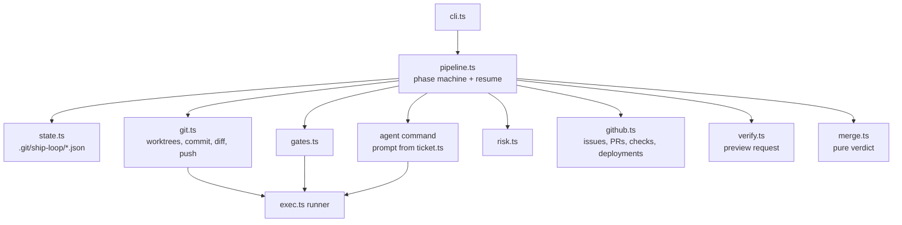

# ship-loop

[](https://github.com/ahzab/ship-loop/actions/workflows/ci.yml)


Take a GitHub issue to a verified preview, and to a merge only when every gate allows it.

```text
issue ─▶ worktree ─▶ agent ─▶ gates ─┬─▶ push ─▶ PR ─▶ preview ─▶ merge gate ─▶ merged
                        ▲            │                                    │
                        └─ fix loop ─┘ (bounded)                          └─▶ a person
```

A coding agent is good at writing the change. It is not the thing you want deciding whether the change reaches production. ship-loop splits those jobs: the agent works in an isolated checkout, and everything after it is plain code with rules you can read. Tests and builds must pass, the diff is scored for risk, the preview has to actually serve a page, and a merge happens only when a named CI check is green and the risk is low. Anything else stops and waits for a person, with the reason written on the PR.

I built the first version of this as the delivery loop for my own products, which I ship next to a full-time job. This is that loop as a standalone tool that works on any GitHub repo.

**See it work:** [ship-loop-demo](https://github.com/ahzab/ship-loop-demo) has real issues, and its pull requests were opened by ship-loop.

## What a run does

| Phase | What happens | Stops for a person when |
|---|---|---|
| `worktree` | Fetches `origin/main` and cuts the issue's branch into its own git worktree, beside the repo. Copies in gitignored files a build needs (`.env`, `.vercel`). Installs dependencies. | the branch is already checked out somewhere else, or install fails |
| `built` | Hands the agent a brief made from the issue: the description, the checkbox acceptance criteria and the rules of the job. Commits whatever it changed. | the agent fails or changes nothing |
| `gated` | Runs every gate (typecheck, tests, build, anything you configure). Failures go back to the agent with their output, for up to 3 rounds. | gates still fail after the last round |
| `pushed` / `pr-open` | Pushes the branch and opens a PR carrying the acceptance criteria, the gate results and the risk report. Labels high-risk PRs `needs-review`. | |
| `preview-verified` | Waits for the host's deployment on that exact commit, then requests the page. A redirect to a login wall is reported as *protected*, never as a pass. | no preview appears, or it answers an error |
| `merged` | Only with `merge.auto`: polls the PR's checks and merges once the required check is green, nothing failed and the risk is within the limit. Merges pinned to the SHA it checked. | any check fails, the required check never runs, the risk is too high, or it times out |

Every phase is recorded in `.git/ship-loop/<issue>.json`. Running the same issue again resumes after the last completed phase, so an interrupted run never pushes twice, opens a second PR or redeploys. After fixing whatever stopped a run, `ship-loop run <issue> --retry` continues from where it stopped with a fresh fix budget.

## Install and run

```sh
npm install -g github:ahzab/ship-loop

cd your-repo                 # origin must be on GitHub
export GITHUB_TOKEN=...      # or be logged in with the gh CLI
ship-loop plan 42            # show the branch, gates, merge policy and the agent's brief
ship-loop run 42             # do it
ship-loop status             # every run and where it is
ship-loop risk               # score the current branch's diff, no issue needed
```

Exit codes: `0` finished (merged, or a verified PR ready for review), `1` stopped for a person, `2` usage or setup error.

The default agent is [Claude Code](https://docs.anthropic.com/en/docs/claude-code) in headless mode. Any command that reads a prompt on stdin and edits files in the current directory works: set `agent.command`.

## Configuration

`ship-loop.config.json` at the repo root. Everything is optional; this is a typical setup:

```json
{
  "install": ["npm", "ci"],
  "agent": { "command": ["claude", "-p", "--permission-mode", "acceptEdits"], "maxFixRounds": 3 },
  "gates": [
    { "name": "typecheck", "run": ["npm", "run", "typecheck"] },
    { "name": "test", "run": ["npm", "test"] },
    { "name": "build", "run": ["npm", "run", "build"] }
  ],
  "preview": { "enabled": true, "timeoutSec": 600, "path": "/api/health" },
  "merge": { "auto": true, "requiredCheck": "test", "maxRisk": "low", "method": "squash" }
}
```

Merging is **off by default**. Turning it on requires naming the CI check that must pass (`requiredCheck`); the config is rejected without one.

### Risk rules

The risk score decides who looks at a change, not whether it is good. It is based on what the diff touches:

- **high**: migrations and SQL, auth and permission code, middleware, CI workflows, or more than twice `maxLines` changed lines
- **medium**: dependency manifests and lockfiles, env files, deploy config, deleted files, more than `maxLines` changed lines, or source changes with no test changes
- **low**: everything else

Each factor lists the files that raised it, and the PR shows them. The globs are configurable under `risk.high` and `risk.medium`. A high-risk change is never merged unattended; `merge.maxRisk` only accepts `low` or `medium`.

## How it is built



`pipeline.ts` owns the order of the phases and nothing else. Every side effect goes through an injected dependency (the process runner, git, the GitHub client, `fetch`, the clock), which is what lets the tests drive whole runs, including crashes, retries and slow CI, without a network or an agent. The merge decision is a pure function of the PR, its checks, the risk and the config, so every refusal is a unit test.

## Design decisions

- **The agent never touches git.** It is told not to commit, push or change branches, and ship-loop does all of it. The agent's job is the diff; the pipeline's job is everything that makes the diff safe to ship. A model that can push can also push the wrong thing.
- **A worktree per issue, cut from a freshly fetched `origin/main`.** Branching in your working copy moves your HEAD, stacks the new work on whatever branch you had checked out, and lets a `git add -A` pick up your half-written files. A separate worktree beside the repo makes all three impossible, and it is idempotent, so a resumed run lands in the same checkout.
- **"All checks passed" is not a merge condition.** It is true of a PR with no checks, and of a PR whose only checks are the hosting provider's deploy statuses, green while nothing ran the tests. ship-loop requires one named CI check to be present and green, refuses when there are no checks at all, and merges with the SHA it verified so a late push cannot slip in.
- **A preview behind a login wall is not a verified preview.** Vercel and Netlify protect previews by redirecting to a login page, and that redirect looks like success to a naive check. ship-loop reports it as `protected`, says so on the PR, and will not auto-merge on it.
- **Bounded loops everywhere.** The fix loop, the preview wait and the merge wait all have a limit. When one runs out, the run stops with the reason and resumes later from the same place. A loop that never gives up burns tokens and CI minutes on a problem that needs a person.
- **Refusals are answers.** When the merge gate says no, ship-loop comments the reason on the PR and exits. It does not look for another route to merge.
- **State lives in `.git`.** Run state is local, shared by every worktree, never committed, and written atomically, so a run killed mid-write cannot corrupt what `resume` reads.
- **No runtime dependencies.** Node 20+, `git`, and `fetch`. TypeScript and Vitest are development-only.

## Development

```sh
npm install
npm test          # 34 tests: units, pipeline scenarios with fakes, real git worktrees
npm run typecheck
npm run build && node dist/cli.js --help
```

## Limits

- GitHub only, and one repo per run.
- Preview detection reads GitHub deployment statuses, which Vercel and Netlify both publish. A host that reports previews another way needs `preview.enabled: false`.
- The risk score is about what a change touches, not whether it is correct. That is what the gates and the reviewer are for.

## License

MIT
